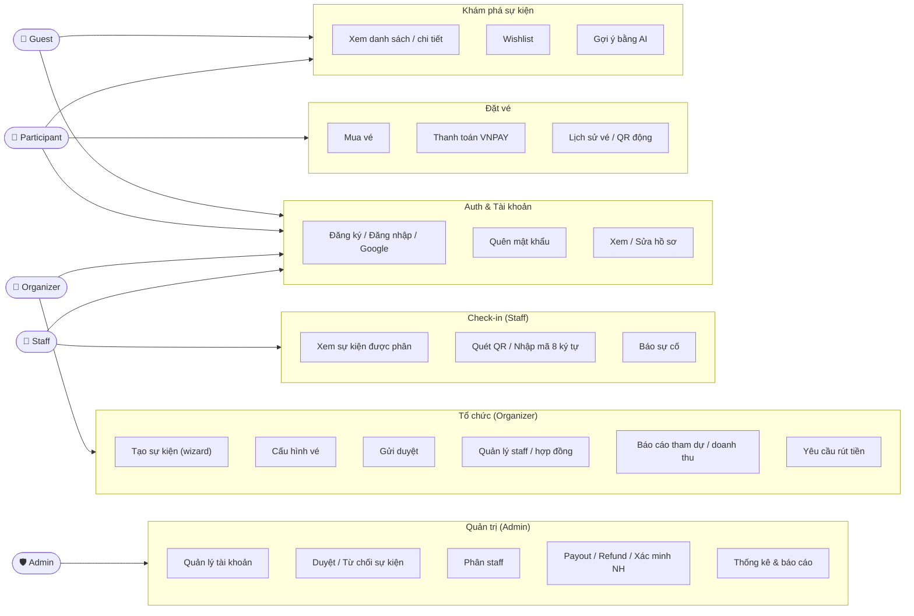
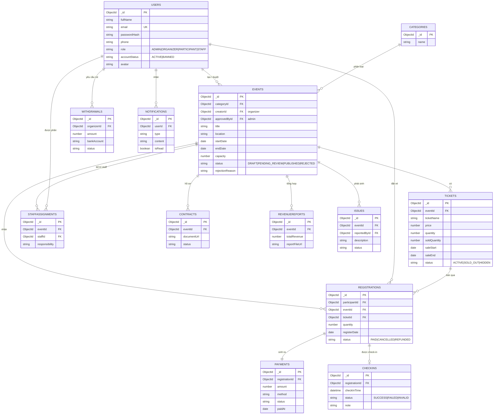
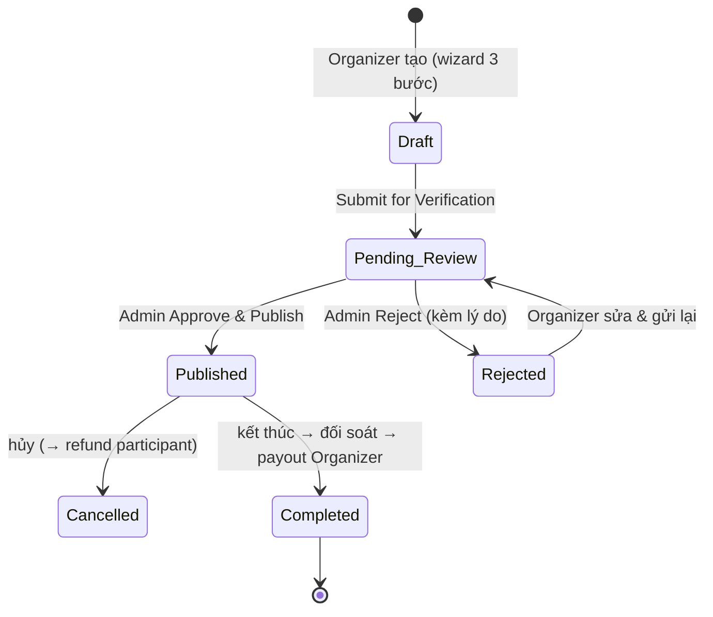

# Business Logic — Event Management System (EventBox)

> Cập nhật: 2026-06-30 · Branch: `develop`
> Tài liệu **nghiệp vụ** (không phải kỹ thuật). Tổng hợp từ **SRS** + phần Overview của
> **Final Report**, đối chiếu hiện trạng code. Đọc kèm [`codebase-summary.md`](./codebase-summary.md),
> [`system-architecture.md`](./system-architecture.md).
>
> **Nguồn & độ tin cậy:**
> - **SRS** (Google Docs): đọc đầy đủ — nguồn chuẩn cho use case, actor, entity, business rule.
> - **Final Report**: chỉ phần *Overview* (bối cảnh, đối thủ, manday, sprint) và *bảng use case*
>   là của Event Management. Các phần sau (Genealogy/Clan/Family Tree, Payos) là **template sót
>   từ dự án khác → KHÔNG áp dụng**.
> - **SDS** (Google Docs): đọc đầy đủ — nguồn chuẩn cho **mô hình dữ liệu** (13 bảng), class
>   design, và enum trạng thái. Schema trực quan: <https://dbdiagram.io/d/Event_Management-6a3810305c789b8acbcbee37>.

---

## 1. Bối cảnh & mục tiêu sản phẩm

**Bối cảnh:** Nền "kinh tế trải nghiệm" ở Việt Nam tăng mạnh (workshop, giải đấu thể thao
phong trào, hội nghị doanh nghiệp, sự kiện cộng đồng). Thị trường sôi động nhưng vận hành
phân mảnh, thủ công, dựa nhiều vào mạng xã hội không an toàn.

**Vấn đề:**
- Nền tảng hiện tại chỉ tập trung **bán vé thương mại quy mô lớn**, thiếu quy trình quản lý
  end-to-end cho sự kiện ngách (pre-screening, logistics, check-in linh hoạt).
- **Logistics & nhân sự thời vụ** (âm thanh/ánh sáng/sân khấu, giấy phép, tuyển staff check-in)
  vẫn làm thủ công → rủi ro lừa đảo, hủy kèo, thiếu nhân sự ngày sự kiện.
- **Check-in thủ công** gây ùn tắc cổng, sai lệch dữ liệu, không có thống kê real-time.

**Giải pháp — EMS (Online-to-Offline):** một "orchestrator" nối quản lý số với vận hành thực
địa cho sự kiện mọi quy mô:
- Hệ sinh thái khép kín **4 actor lõi** (Admin · Organizer · Participant · Staff) trên một
  CSDL thống nhất, phân quyền **RBAC**.
- Tự động hóa đăng ký/đặt vé, xác thực vé động, theo dõi trạng thái.
- Dịch vụ **logistics & cấp nhân sự theo yêu cầu** (Event BPaaS) dưới sự giám sát của Admin.
- **Dashboard phân tích** real-time (tốc độ đăng ký, phân bố tham dự, vận tốc check-in) + CRM.

**Khác biệt so với đối thủ (Ticketbox):** Ticketbox mạnh về traffic + hạ tầng thanh toán nhưng
*thuần thương mại*, **không** có duyệt sự kiện riêng tư, **không** sourcing logistics, **không**
mạng lưới staff, **phí hoa hồng cao**. EventBox bù đúng các khoảng trống này + phí thấp hơn cho
tổ chức nhỏ/cộng đồng.

---

## 2. Actor & vai trò (RBAC)

SRS định nghĩa 6 actor; ánh xạ sang 4 `role` trong code (`Guest`/`User` là trạng thái chưa
đăng nhập / đã đăng nhập chung, không phải role lưu DB):

| Actor (SRS) | Mô tả nghiệp vụ | Role trong code |
|-------------|-----------------|-----------------|
| **Guest** | Khách chưa đăng nhập: xem trang chủ, danh sách/chi tiết sự kiện, đăng ký/đăng nhập | (không đăng nhập) |
| **User** | Người đã đăng nhập (chung) | bất kỳ role |
| **Participant** | Người tham dự: mua vé, thanh toán, vé của tôi, wishlist, thông báo | `PARTICIPANT` (mặc định) |
| **Organizer** | Nhà tổ chức: tạo/sửa sự kiện, cấu hình vé, quản lý staff & hợp đồng, xem/ rút doanh thu | `ORGANIZER` |
| **Staff** | Nhân viên check-in tại cổng: xem sự kiện được phân, check vé (QR/thủ công), báo sự cố | `STAFF` |
| **Admin** | Quản trị: quản lý tài khoản, duyệt sự kiện, quản lý vé/marketing/hợp đồng, thống kê, thanh toán/payout/refund | `ADMIN` |

> Quy tắc tài khoản (đã hiện thực): chỉ tạo `ADMIN` đầu tiên qua bootstrap; `STAFF` do Admin
> tạo (không tự đăng ký); self-register chỉ `PARTICIPANT`/`ORGANIZER`. Admin không tự
> khóa/đổi-role/xóa chính mình.

### 2.1 Luồng xác thực & kích hoạt

#### Participant & Organizer (Self-register)
- **Đăng ký:** Email → OTP (6 chữ số, TTL 5 phút) → mật khẩu → tạo tài khoản, status `ACTIVE`.
- **Đăng nhập:** Email/password hoặc Google OAuth; JWT trong cookie HttpOnly (7 ngày).
- **Profile:** `GET /me` xem, `PUT /me` sửa họ tên & mật khẩu (yêu cầu mật khẩu hiện tại).

#### Staff (Admin-managed activation)
1. **Admin cấp tài khoản:** `POST /admin/staff` với email + họ tên.
   - Hệ thống tạo tài khoản status `PENDING` + sinh mật khẩu tạm 10 ký tự.
   - Tạo activation token (JWT, hạn 7 ngày, purpose="activation").
   - Gửi email chứa: email + mật khẩu tạm + link `/activate?token=...`.

2. **Staff kích hoạt:** `POST /activate` với token + họ tên (tùy) + mật khẩu mới.
   - Xác thực token (JWT, purpose="activation").
   - Cập nhật họ tên nếu có; hash & lưu mật khẩu mới (bcrypt 10 rounds).
   - Chuyển status `PENDING` → `ACTIVE`.
   - Lưu ý: Staff **không thể** đăng nhập khi status `PENDING`.

3. **Cập nhật hồ sơ:** Sau kích hoạt, `PUT /me` dùng được bình thường.

#### Trạng thái tài khoản
- `ACTIVE`: Tài khoản hoạt động; đăng nhập được.
- `PENDING`: Tài khoản chờ kích hoạt (STAFF mới); không đăng nhập được.
- `BANNED`: Tài khoản bị khóa; Admin/hệ thống khóa; không đăng nhập được.

---

## 3. Danh mục nghiệp vụ (61 use case, 5 nhóm)

### Sơ đồ use-case tổng quan

| Nhóm | Use case tiêu biểu |
|------|--------------------|
| **Authentication & Authorization** (7) | Đăng ký, Đăng nhập Google, Đăng nhập, Đăng xuất, Quên mật khẩu, Xem/Sửa hồ sơ |
| **Organizer Management** (13) | Tạo sự kiện, Cấu hình loại vé, Gửi duyệt, Sửa/Xem/Xóa sự kiện, Quản lý staff, Quản lý hợp đồng, Xem/Xuất danh sách tham dự, Xem/Xuất báo cáo doanh thu, **Yêu cầu rút doanh thu** |
| **Participant Management** (14) | Xem danh sách/chi tiết sự kiện, **Gợi ý sự kiện bằng AI**, Đăng ký dự, Mua vé, Thanh toán, Lịch sử vé, Chi tiết vé (QR động), Wishlist (xem/thêm/xóa), Thông báo (xem/chi tiết/xóa) |
| **Staff Management** (7) | Quản lý/Xem sự kiện được phân, Xem danh sách tham dự, Báo sự cố, Check vé, **Quét QR**, **Nhập mã vé 8 ký tự thủ công** |
| **Admin Management** (20) | Quản lý & CRUD tài khoản, Phân staff cho sự kiện, Kiểm tra báo cáo/scam, Cập nhật trạng thái user, Quản lý mọi sự kiện, **Duyệt/Từ chối sự kiện (kèm lý do)**, Quản lý bán vé/marketing/hợp đồng, Thống kê (tháng/năm), Quản lý thanh toán, **Refund / Payout / Xác minh tài khoản ngân hàng** |

---

## 4. Thực thể nghiệp vụ (13 entity)

| # | Entity | Vai trò nghiệp vụ |
|---|--------|-------------------|
| 1 | **User** | Tài khoản (Admin/Organizer/Participant/Staff) |
| 2 | **Category** | Phân loại sự kiện để duyệt/tìm kiếm |
| 3 | **Event** | Sự kiện do Organizer tạo (tiêu đề, mô tả, địa điểm, ngày, sức chứa, trạng thái, category) |
| 4 | **Ticket** | Loại vé gắn sự kiện (giá, số lượng, tồn, quyền lợi) |
| 5 | **Registration** | Bản ghi đăng ký dự sự kiện của participant (trạng thái + thông tin tham dự) |
| 6 | **Payment** | Giao dịch từ đăng ký (số tiền, phương thức, trạng thái, ngày) |
| 7 | **Checkin** | Xác nhận tham dự thực tế tại cổng |
| 8 | **StaffAssignment** | Gán staff vào sự kiện + trách nhiệm |
| 9 | **Contact** | Yêu cầu hỗ trợ/liên hệ tới admin/organizer |
| 10 | **Withdrawal** | Yêu cầu rút tiền / hoàn tiền theo chính sách |
| 11 | **RevenueReport** | Báo cáo doanh thu/bán vé/hiệu quả tài chính |
| 12 | **Issue** | Sự cố/khiếu nại về sự kiện/đăng ký/thanh toán |
| 13 | **Notification** | Thông báo hệ thống (duyệt sự kiện, xác nhận thanh toán, cập nhật rút tiền, xử lý sự cố...) |

> **Hiện trạng code:** mới có `User`, `Event`, `OTP`. Các entity còn lại (Category, Ticket,
> Registration, Payment, Checkin, StaffAssignment, Contract, Withdrawal, RevenueReport, Issue,
> Notification) **chưa hiện thực** — xem §9.

### 4.1 Chi tiết mô hình dữ liệu (theo SDS)

SDS định nghĩa 13 bảng MongoDB (schema: link dbdiagram ở đầu tài liệu). Các field & enum chính:

- **Users**: `_id, fullName, email, phone, passwordHash, avatar, role[ADMIN|ORGANIZER|PARTICIPANT|STAFF],
  accountStatus[ACTIVE|BANNED], createdAt, updatedAt` + method `comparePassword()`.
- **Categories**: phân loại sự kiện (Sports, Music, Education, Technology...).
- **Events**: `_id, categoryId→Category, creatorId→User(organizer), approvedById/reviewedBy→User(admin),
  title, description, location, banner, startDate/endDate, capacity,
  status[DRAFT|PENDING_REVIEW|PUBLISHED|REJECTED], rejectionReason, reviewedAt, timestamps`.
- **Tickets** (loại vé, tham chiếu `eventId`): `ticketName, description, price, quantity, soldQuantity,
  saleStart, saleEnd, status[ACTIVE|SOLD_OUT|HIDDEN]`.
- **Registrations** (đăng ký/đặt vé): `participantId→User, eventId, ticketId, quantity, registerDate,
  status[PAID|CANCELLED|REFUNDED]`. *(ID registration thường dùng làm dữ liệu QR vé.)*
- **Payments**: giao dịch từ registration (số tiền, phương thức, trạng thái, ngày).
- **CheckIns**: `registrationId, checkInTime, status[SUCCESS|FAILED|INVALID], note`.
- **StaffAssignments**: gán staff vào sự kiện + trách nhiệm.
- **Contracts**: tài liệu pháp lý / giấy phép / hồ sơ tổ chức.
- **Withdrawals**: yêu cầu rút tiền của Organizer + kết quả duyệt của Admin.
- **RevenueReports**: báo cáo doanh thu + file báo cáo + lịch sử.
- **Issues**: sự cố/khiếu nại + kết quả xử lý.
- **Notification**: thông báo hệ thống (duyệt sự kiện, xác nhận thanh toán, cập nhật rút tiền...).

**Lưu ý mâu thuẫn thiết kế (cần chốt):**
- **Vé**: phần *Create Event* (SDS) mô tả `ticketTypes` là **subdocument nhúng** trong `Event`
  (`name, price, totalStock, remainingStock, seatMapZones`); nhưng phần *Booking/Checkin* lại coi
  **Ticket là collection riêng** (`eventId, soldQuantity...`). → cần thống nhất nhúng vs tách bảng.
- **Logistics**: subdocument `logisticsRequest` (`infrastructurePackages, permitDocumentUrl,
  supportStatus`) nhúng trong Event; upload file PDF/DOCX/PNG ≤ 15MB qua `FileStorageService`.
- **Đặt tên field** lệch giữa các phần SDS: `startDatetime/endDatetime` vs `startDate/endDate`;
  `approvedById` vs `reviewedBy`. → chọn một quy ước khi hiện thực.
- **Contact vs Contracts**: SRS liệt kê entity *Contact* (yêu cầu hỗ trợ); SDS dùng bảng
  *Contracts* (hồ sơ pháp lý). Đây là **hai khái niệm khác nhau** — xác nhận giữ cả hai hay bỏ một.

---

### 4.2 Sơ đồ ERD tổng

> **Ghi chú độ chính xác:** quan hệ + field của `Users/Events/Tickets/Registrations/CheckIns`
> bám sát class-spec trong SDS. Field của `Payments/Contracts/Withdrawals/RevenueReports/Issues/
> Notifications` là **suy luận hợp lý** (SDS chỉ mô tả ở mức bảng, chưa liệt kê field) — cần chốt
> lại khi thiết kế chi tiết. Quan hệ `USERS–EVENTS` gộp hai vai trò *creatorId* (organizer) và
> *approvedById* (admin) trên một đường cho gọn.

## 5. Vòng đời sự kiện (Event lifecycle)

**Quy tắc:**
- Sự kiện **không lên public** cho đến khi Admin chuyển sang `Published`.
- Khi ở `Pending_Review`, Organizer **không** được sửa (bị khóa trong hàng đợi duyệt).
- Khi `Rejected`: nhả slot/tài nguyên đã giữ; Organizer nhận log lý do để sửa.
- Tồn kho vé & sơ đồ ghế gắn bất biến với `Event ID`.

> **Lệch với code:** SDS chốt enum `Event.status` = `DRAFT | PENDING_REVIEW | PUBLISHED | REJECTED`
> (+ `reviewedBy`, `reviewedAt`, `rejectionReason`). Code hiện là `draft | published | cancelled |
> completed` — **thiếu `pending_review`/`rejected`** (và `cancelled/completed` chưa có trong SDS).
> Cần đồng bộ khi làm luồng duyệt (xem §9).

---

## 6. Các luồng nghiệp vụ chính

### 6.1 Xác thực & phân quyền
- Đăng nhập email/mật khẩu hoặc **Google**; tài khoản Google phải liên kết user đã verify.
- Đăng ký kèm **OTP email**; quên mật khẩu khôi phục qua email.
- Phiên dùng **JWT trong cookie HttpOnly** (RBAC). *(SRS nêu 2FA & Facebook ở phần lẫn template
  — KHÔNG thuộc phạm vi Event Management; bỏ qua.)*

### 6.2 Tạo sự kiện (Organizer) — wizard 3 bước
1. **Thông tin chung**: tiêu đề, category, ngày-giờ (phải ở tương lai), mô tả, địa điểm.
2. **Cấu hình vé & tồn kho**: định nghĩa tier (VIP/Standard...), giá (≥ 0), sức chứa tối đa,
   sơ đồ ghế 2D tùy chọn.
3. **Logistics & giấy phép**: chọn dịch vụ nền tảng (âm thanh/ánh sáng, thuê đồ, tuyển staff
   check-in, hỗ trợ giấy phép) + upload tài liệu (PDF/DOCX/PNG, ≤ 15MB).
→ **Submit for Verification** → trạng thái `Pending_Review`, đẩy vào hàng đợi duyệt của Admin.
- *Other:* UI auto-save nháp mỗi 60 giây.

### 6.3 Admin duyệt sự kiện
- Admin mở hàng đợi `Pending_Review` → xem chi tiết (vé, sơ đồ ghế, hồ sơ pháp lý/hợp đồng).
- **Approve & Publish** → `Published`, đẩy lên directory công khai, gửi thông báo Organizer.
- **Reject** (bắt buộc nhập **lý do/correction log**) → `Rejected`, khóa public, gửi log về
  Organizer.
- Chống xung đột đồng thời (concurrency): nếu bản ghi bị sửa bởi user khác khi đang duyệt →
  chặn ghi đè, yêu cầu refresh.

### 6.4 Đặt vé & thanh toán (Participant) — qua VNPAY
1. Chọn tier/ghế, số lượng (pre-fill thông tin liên hệ từ hồ sơ).
2. **Giữ chỗ tạm 10 phút** (chống double-booking) + đồng hồ đếm ngược hiển thị.
3. Áp **voucher** giảm giá (%, hoặc số tiền) → tính tổng cuối.
4. Chọn **VNPAY** → redirect cổng thanh toán → người dùng trả qua banking QR/thẻ.
5. Backend nghe **IPN callback** → xác nhận `Paid` → **mới** trừ tồn kho vĩnh viễn → sinh
   **E-ticket + QR động** → gửi hóa đơn PDF qua email.
- **Hủy/timeout/hết vé** → rollback, nhả chỗ giữ, báo người dùng.

### 6.5 Check-in tại cổng (Staff)
- **Quét QR** bằng camera, hoặc **nhập mã vé 8 ký tự thủ công** (fallback khi không có camera /
  demo desktop). Mã 8 ký tự alphanumeric, so khớp không phân biệt hoa-thường.
- Kiểm tra: vé thuộc đúng `Event ID` + trong khung giờ + trạng thái `Unused`.
- Hợp lệ → chuyển `Used` (bất biến, **không** revert), ghi timestamp + Staff ID, tăng bộ đếm
  tham dự real-time.
- **Ngoại lệ**: vé đã `Used` (chặn vào lại) · mã sai/không đúng sự kiện · **QR hết hạn**
  (token động đổi mỗi **30 giây** — chống chụp màn hình/giả mạo).
- Mất mạng tại cổng → cache log offline, đồng bộ khi có mạng.
- Dashboard real-time: `[Đã check-in] / [Tổng đăng ký]`.

### 6.6 Tài chính (Organizer + Admin)
- Organizer: xem/xuất **báo cáo doanh thu**; gửi **yêu cầu rút tiền** (nhập tài khoản ngân hàng).
- Admin: **đối soát hợp đồng** khi sự kiện hoàn tất → **Approve Payout** (giải ngân cho
  Organizer) · **Process Refund** (hoàn tiền participant khi sự kiện bị hủy) · **Xác minh tài
  khoản ngân hàng**.
- Phí nền tảng: **dạng % trên doanh thu** (định vị thấp hơn đối thủ; **% cụ thể chưa nêu** —
  xem §10).

### 6.7 Khác
- **Staff assignment**: Organizer phân staff cho sự kiện; Admin có thể điều phối staff hệ thống
  khi thiếu nhân sự.
- **Wishlist** (Participant), **Notification** (kết quả duyệt, xác nhận thanh toán, nhắc nhở...),
  **AI gợi ý sự kiện** theo sở thích, **Issue reporting** (Staff/Participant).

---

## 7. Tổng hợp business rule cốt lõi

1. Sự kiện chỉ public khi Admin `Published`; `Pending_Review` thì Organizer không sửa được.
2. Ngày sự kiện phải ở **tương lai**; giá vé **≥ 0**; sức chứa theo giới hạn nền tảng.
3. Tồn kho vé chỉ **trừ vĩnh viễn khi callback thanh toán thành công**; giữ chỗ tạm **10 phút**.
4. Vé `Used` là **bất biến**; QR động đổi mỗi **30 giây**.
5. Mật khẩu hash **bcrypt ≥ 10 rounds**; JWT trong **cookie HttpOnly** (chống XSS/CSRF).
6. Mỗi giao dịch ghi log (timestamp, IP, gateway ref) phục vụ audit tài chính.
7. Quy tắc tài khoản (admin bootstrap, STAFF do admin tạo, không tự-khóa-mình) — đã hiện thực.

---

## 8. Yêu cầu phi chức năng liên quan nghiệp vụ

- **Bảo mật**: bcrypt 10 rounds, HTTPS/TLS, RBAC + JWT cookie HttpOnly, QR động 30s, input
  sanitization.
- **Hiệu năng**: đọc < 2s; ≥ 500 giao dịch đặt vé/phút lúc cao điểm; check-in đồng bộ < 1s;
  phân trang 20–50 bản ghi/trang.
- **Khả dụng**: uptime ≥ 99.9%; backup ngày; fault-tolerance thanh toán (giữ `Pending` + giữ
  chỗ 10 phút khi rớt mạng).
- **UX**: responsive (đặc biệt màn check-in & vé trên mobile); 2 chế độ check-in (camera +
  thủ công 8 ký tự); toast màu chuẩn (xanh/đỏ/hổ phách).

---

## 9. Đối chiếu hiện trạng code ↔ spec nghiệp vụ

| Mảng nghiệp vụ | Spec (SRS) | Hiện trạng code |
|----------------|-----------|-----------------|
| Auth (login/register/google/OTP) | ✅ | ✅ Đã có (module `user`) |
| Quản trị tài khoản (CRUD, role, ban) | ✅ | ✅ Đã có (`/api/users/admin`) |
| Quên mật khẩu | ✅ | ❌ Chưa có |
| Sự kiện — CRUD cơ bản | ✅ | ⚠️ CRUD có nhưng **routes chưa bảo vệ auth/role** |
| Luồng duyệt sự kiện (Pending/Approve/Reject) | ✅ | ❌ Thiếu `pending_review`/`rejected` trong enum + chưa có hàng đợi duyệt |
| Loại vé & tồn kho (Ticket) | ✅ | ❌ Chưa có entity/luồng |
| Đăng ký + thanh toán VNPAY (Registration/Payment) | ✅ | ❌ Chưa có |
| Check-in (QR động + 8 ký tự) | ✅ | ❌ Chưa có |
| Staff assignment | ✅ | ❌ Chưa có |
| Tài chính (withdrawal/payout/refund/RevenueReport) | ✅ | ❌ Chưa có |
| Wishlist / Notification / Issue / Contact / Category | ✅ | ❌ Chưa có |
| AI gợi ý sự kiện | ✅ | ❌ Chưa có |
| Dashboard thống kê | ✅ | ⚠️ UI có nhưng chạy **mock data** |

> Kết luận: code đang hoàn thiện **Auth + quản trị tài khoản**; phần lõi nghiệp vụ sự kiện
> (vé, thanh toán, check-in, duyệt, tài chính) **chưa hiện thực**. Đây là backlog chính.
