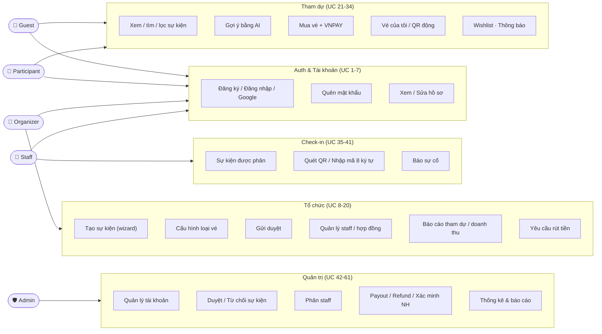
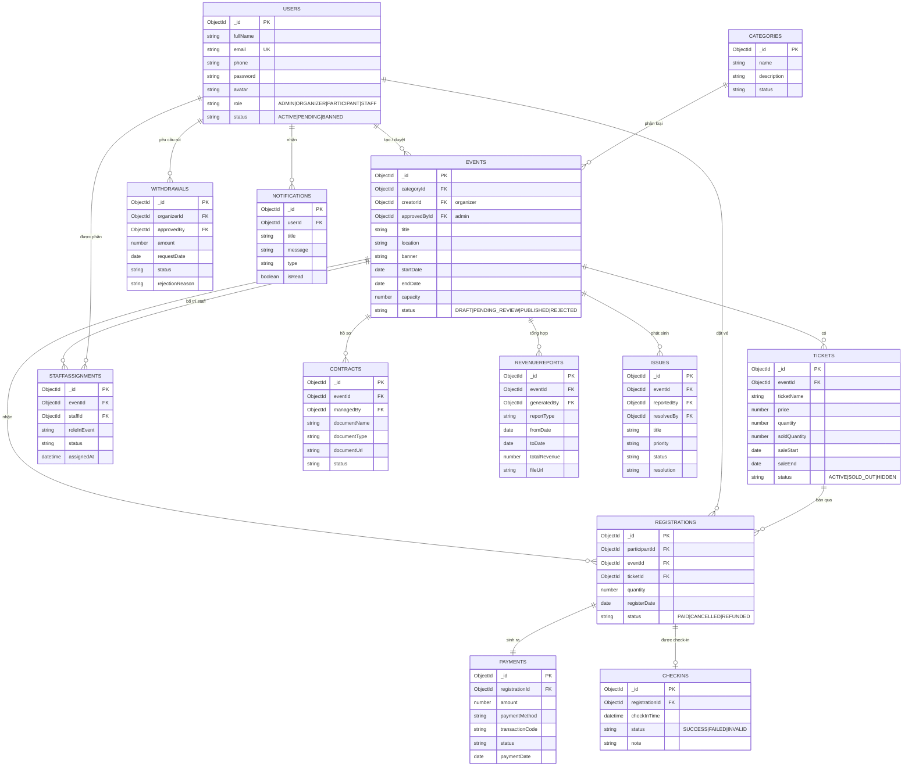
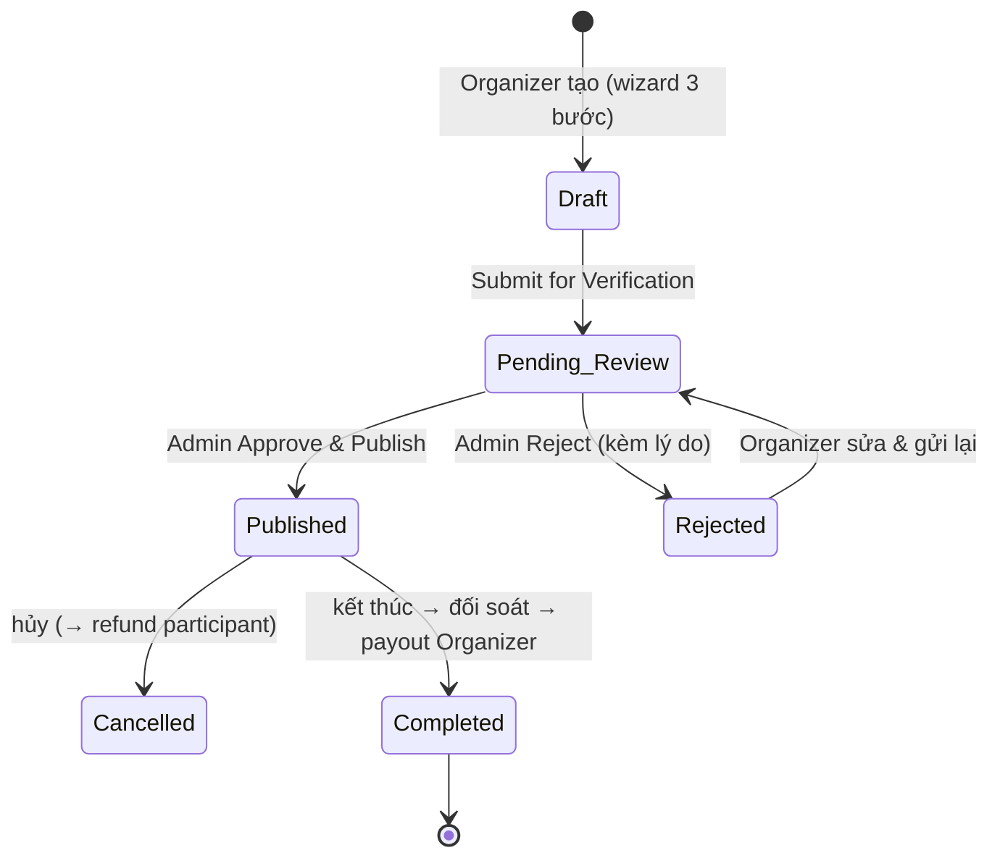

# Business Logic — Event Management System (EventBox)

> Cập nhật: 2026-07-05 · Branch: `develop`
> Tài liệu **nghiệp vụ** (không phải kỹ thuật). Tổng hợp từ **SRS + SDS + Final Report**
> (bản Google Docs, đọc đầy đủ text **và toàn bộ sơ đồ/hình ảnh**: context diagram, use-case
> diagram từng actor, screen flow, ERD, database schema, UI mockup), đối chiếu hiện trạng code.
> Đọc kèm [`codebase-summary.md`](./codebase-summary.md), [`system-architecture.md`](./system-architecture.md).
>
> **Nguồn & độ tin cậy:**
> - **SRS — Software Requirement Specification** (Hanoi, 06/2026): nguồn chuẩn cho use case (61),
>   actor (6), màn hình (33), ma trận phân quyền, business rule, NFR, 5 đặc tả FR chi tiết
>   (AT-01, CE-01, TB-01, TC-01, AM-01).
> - **SDS — Software Design Specification** (Hanoi, 05/2025): nguồn chuẩn cho **mô hình dữ liệu 13
>   bảng** (đã đọc schema đầy đủ từng field), class design, enum trạng thái.
>   Schema trực quan: <https://dbdiagram.io/d/Event_Management-6a3810305c789b8acbcbee37>.
> - **Final Report** (Hanoi, 06/2026): chỉ dùng **§I Overview** (bối cảnh, đối thủ, 600 man-hours,
>   team 5 người), **§II Scrum** (4 sprint) và **§III bảng use case**. Từ **§IV trở đi**
>   (Family Tree/Clan/Genealogy, subscription, honhaminh.com...) là **template sót từ dự án
>   khác → KHÔNG áp dụng**.

---

## 1. Bối cảnh & mục tiêu sản phẩm

**Bối cảnh:** Nền "kinh tế trải nghiệm" ở Việt Nam tăng mạnh (workshop chuyên môn, giải đấu thể
thao phong trào, hội nghị doanh nghiệp, sự kiện cộng đồng). Thị trường sôi động nhưng vận hành
phân mảnh, thủ công, dựa nhiều vào mạng xã hội không an toàn.

**Vấn đề:**
- Nền tảng hiện tại chỉ tập trung **bán vé thương mại quy mô lớn**, thiếu quy trình quản lý
  end-to-end cho sự kiện vừa & nhỏ (pre-screening, logistics, check-in linh hoạt).
- **Logistics & nhân sự thời vụ** (âm thanh/ánh sáng/sân khấu, giấy phép, tuyển staff check-in)
  vẫn làm thủ công qua mạng xã hội chưa kiểm chứng → rủi ro lừa đảo, hủy kèo, thiếu nhân sự.
- **Check-in thủ công** gây ùn tắc cổng, sai lệch dữ liệu, không có thống kê real-time.

**Giải pháp — EMS (Online-to-Offline):** một "orchestrator" nối quản lý số với vận hành thực địa:
- Hệ sinh thái khép kín **4 actor lõi** (Admin · Organizer · Participant · Staff) trên một CSDL
  thống nhất, phân quyền **RBAC** chặt ("a flawless data flow and strict RBAC").
- Tự động hóa đăng ký/đặt vé, xác thực vé QR động, theo dõi trạng thái real-time.
- Dịch vụ **logistics & cấp nhân sự theo yêu cầu** dưới sự giám sát của Admin.
- **Dashboard phân tích** dữ liệu (đăng ký, tham dự, doanh thu) cho Organizer & Admin.

**Khác biệt so với đối thủ (Ticketbox):** Ticketbox mạnh về xử lý concurrency + seat map tương
tác nhưng *thuần thương mại*: **không** có workflow duyệt sự kiện riêng tư/doanh nghiệp,
**không** sourcing logistics, **không** mạng lưới staff, giá kém linh hoạt với organizer nhỏ.
EventBox bù đúng các khoảng trống này.

**Quy mô dự án** (Final Report §I–II): 10 tuần · 5 người · 600 man-hours; Scrum (PO: Nguyen Khac
Trang, SM: Duong Tuan Anh); quản lý bằng Jira + Confluence.

### 1.1 Phạm vi giao theo Sprint (Final Report §II)

| Sprint | Phạm vi chính |
|--------|---------------|
| 1 | Khởi tạo dự án, Home & Event Discovery, Auth (đăng ký, Google OAuth), quản lý tài khoản/role |
| 2 | Event Management (tạo/sửa/lịch), cấu hình vé & tồn kho, workflow duyệt sự kiện, nộp giấy phép |
| 3 | Mua vé & xác nhận thanh toán, vé đã mua & lịch sử, quản lý attendee & check-in (E-ticket), vận hành & báo sự cố, notification |
| 4 | Triển khai hệ thống, quản trị hợp đồng/giấy phép, tài chính & doanh thu, **VNPay + callback**, dashboard analytics/marketing/report, xử lý sự cố |

---

## 2. Actor & vai trò (RBAC)

SRS định nghĩa 6 actor; ánh xạ sang 4 `role` trong code (`Guest`/`User` là trạng thái chưa
đăng nhập / đã đăng nhập chung, không phải role lưu DB):

| Actor (SRS) | Mô tả nghiệp vụ | Role trong code |
|-------------|-----------------|-----------------|
| **Guest** | Khách chưa đăng nhập: xem danh sách/chi tiết/tìm kiếm/lọc sự kiện, đăng ký tài khoản, Google SSO | (không đăng nhập) |
| **User** | Người đã đăng nhập (chung): login/logout, quên mật khẩu, xem/sửa hồ sơ | bất kỳ role |
| **Participant** | Người tham dự: mua vé, thanh toán, vé của tôi (QR), wishlist, thông báo | `PARTICIPANT` (mặc định) |
| **Organizer** | Nhà tổ chức: tạo/sửa sự kiện, cấu hình vé, gửi duyệt, quản lý staff & hợp đồng, báo cáo tham dự/doanh thu, rút tiền | `ORGANIZER` |
| **Staff** | Nhân viên check-in tại cổng: sự kiện được phân, danh sách tham dự, check vé (QR/mã 8 ký tự), báo sự cố | `STAFF` |
| **Admin** | Quản trị: tài khoản, duyệt/từ chối sự kiện, phân staff, vé/marketing/hợp đồng, thống kê, payout/refund | `ADMIN` |

**Hệ thống ngoài** (context diagram): **Google Services** (SSO cho Guest/User) và **VNPAY**
(payment request/status). Luồng dữ liệu chính: Organizer ↔ hệ thống (event data, ticket config,
contract, withdrawal, permit) · Participant ↔ hệ thống (event data, payment) · Staff ↔ hệ thống
(assignment, check-in data, issue) · Admin ↔ hệ thống (governance: account,
event, ticket, marketing, contract, payment, reporting).

> Quy tắc tài khoản (đã hiện thực — verified `user.service.ts`): chỉ tạo `ADMIN` đầu tiên qua
> bootstrap; `STAFF` do Admin tạo (không tự đăng ký); self-register chỉ `PARTICIPANT`/`ORGANIZER`.
> Admin không tự khóa/đổi-role/xóa chính mình.

### 2.1 Luồng xác thực & kích hoạt

#### Participant & Organizer (Self-register)
- **Đăng ký:** Email → OTP (6 chữ số, TTL 5 phút) → mật khẩu → tạo tài khoản, status `ACTIVE`.
- **Đăng nhập:** Email/password hoặc Google OAuth; JWT trong cookie HttpOnly (7 ngày).
- **Profile:** `GET /me` xem, `PUT /me` sửa họ tên & mật khẩu (yêu cầu mật khẩu hiện tại).

#### Staff (Admin-managed activation)
1. **Admin cấp tài khoản:** `POST /admin/staff` với email + họ tên → tạo tài khoản `PENDING`
   + mật khẩu tạm, gửi email chứa link `/activate?token=...` (JWT purpose="activation", hạn 7 ngày).
2. **Staff kích hoạt:** `POST /activate` với token + mật khẩu mới → `PENDING` → `ACTIVE`.
   Staff **không thể** đăng nhập khi còn `PENDING`.

#### Trạng thái tài khoản
- `ACTIVE`: hoạt động, đăng nhập được · `PENDING`: chờ kích hoạt (STAFF mới) · `BANNED`: bị khóa.

### 2.2 Danh mục màn hình & phân quyền (SRS — 33 màn hình)

| Nhóm | Màn hình | Quyền truy cập |
|------|----------|----------------|
| Chung | Home page · View Event Detail | Tất cả (kể cả Guest) |
| Auth | Register · Login · Forgot Password | Guest |
| Tài khoản | User profile | Mọi role đã đăng nhập |
| Participant | Ticket & Seat selection · Confirm & Checkout · View ticket booked | Participant |
| Organizer | Organizer Dashboard · General Info (wizard B1) · Ticket & Seat mapping (B2) · Logistics & Permit Upload (B3) · View event status · Attendee Tracker Table · Financial Analytics · Withdrawal Request Form | Organizer |
| Staff | Staff screen · Assigned Events List · Gate Operations Hub · Camera QR Scanner Mode · Manual 8-Char Input Mode | Staff |
| Admin | Admin Dashboard · Account Management · CRUD account · Event staff assignment · Event Management · Events Pending · Events Detail · Ticket sale management · Data & revenue report · Contract Review Layout · Execute Payout/Refund | Admin |

**Screen flow chính** (theo sơ đồ SRS Figure 1.2.1): sau Login rẽ nhánh theo role —
Home → Event Detail → Ticket & Seat selection → Confirm & Checkout → View ticket booked (Participant);
Organizer Dashboard → wizard 3 bước → View event status, + Attendee Tracker / Financial Analytics
→ Withdrawal; Staff screen → Assigned Events → Gate Operations Hub → QR Scanner / Manual Input;
Admin Dashboard → Account Management → CRUD → Staff assignment · Event Management → Events
Pending/Detail → Ticket sale · Data & revenue report → Contract Review → Payout/Refund.

---

## 3. Danh mục nghiệp vụ (61 use case, 5 nhóm)

### Sơ đồ use-case tổng quan

```mermaid
flowchart LR
  GUEST(["🧑 Guest"])
  PART(["🎫 Participant"])
  ORG(["📅 Organizer"])
  STAFF(["🛂 Staff"])
  ADMIN(["🛡️ Admin"])

  subgraph AUTH["Auth & Tài khoản (UC 1-7)"]
    A1["Đăng ký / Đăng nhập / Google"]
    A2["Quên mật khẩu"]
    A3["Xem / Sửa hồ sơ"]
  end
  subgraph ORGM["Tổ chức (UC 8-20)"]
    O1["Tạo sự kiện (wizard)"]
    O2["Cấu hình loại vé"]
    O3["Gửi duyệt"]
    O4["Quản lý staff / hợp đồng"]
    O5["Báo cáo tham dự / doanh thu"]
    O6["Yêu cầu rút tiền"]
  end
  subgraph PARTM["Tham dự (UC 21-34)"]
    P1["Xem / tìm / lọc sự kiện"]
    P2["Gợi ý bằng AI"]
    P3["Mua vé + VNPAY"]
    P4["Vé của tôi / QR động"]
    P5["Wishlist · Thông báo"]
  end
  subgraph STAFFM["Check-in (UC 35-41)"]
    S1["Sự kiện được phân"]
    S2["Quét QR / Nhập mã 8 ký tự"]
    S3["Báo sự cố"]
  end
  subgraph ADMM["Quản trị (UC 42-61)"]
    M1["Quản lý tài khoản"]
    M2["Duyệt / Từ chối sự kiện"]
    M3["Phân staff"]
    M4["Payout / Refund / Xác minh NH"]
    M5["Thống kê & báo cáo"]
  end

  GUEST --> AUTH & PARTM
  PART --> AUTH & PARTM
  ORG --> AUTH & ORGM
  STAFF --> AUTH & STAFFM
  ADMIN --> ADMM
```

### Bảng use case đầy đủ (SRS master table)

| ID | Nhóm | Use case | Ghi chú nghiệp vụ |
|----|------|----------|-------------------|
| 1–7 | Auth & Authorization | Register Account · Authenticate with Google · Login · Logout · Forgot Password · View Profile · Update Profile | Google SSO phải liên kết tài khoản đã verify |
| 8 | Organizer | Create Event | Wizard tạo nháp sự kiện |
| 9 | Organizer | Configure Ticket Types | Tier vé + giá + tồn kho |
| 10 | Organizer | Submit for Verification | Đẩy vào hàng đợi duyệt của Admin |
| 11–13 | Organizer | Update / View / Delete Event | Sửa chỉ khi còn nháp |
| 14 | Organizer | Manage Staff | Gán staff check-in cho sự kiện |
| 15 | Organizer | Manage Contract | Hợp đồng logistics & thuê địa điểm |
| 16–17 | Organizer | View / Export Attendee List | Danh sách tham dự + xuất file |
| 18–19 | Organizer | View / Export Revenue Report | Thống kê bán vé, doanh thu |
| 20 | Organizer | Request Revenue Withdrawal | Yêu cầu giải ngân doanh thu |
| 21–22 | Participant | View List Event · View Event Details | Public, kể cả Guest |
| 23 | Participant | AI Event Recommendations | Gợi ý theo sở thích |
| 24–26 | Participant | Register for Event · Buy Ticket · Make Payment | Thanh toán qua cổng ngoài (VNPAY) |
| 27–28 | Participant | View Ticket History · View Ticket Details | Chi tiết vé kèm QR động |
| 29–31 | Participant | View / Add / Remove Event Wishlist | Sự kiện đã lưu |
| 32–34 | Participant | View List / View Details / Delete Notifications | Thông báo hệ thống |
| 35–37 | Staff | Manage / View Assigned Events · View Attendee List | Sự kiện + cổng được phân công |
| 38 | Staff | Report Event Issue | Ghi nhận sự cố vận hành |
| 39–41 | Staff | Check Ticket · Scan Ticket QR Code · Enter Ticket Code Manually | 2 chế độ: camera QR & mã 8 ký tự |
| 42–46 | Admin | Manage account · CRUD user account · Assign staff to event · Check validate report · Update user status | Trạng thái Active/Suspended/Banned |
| 47–50 | Admin | Manage all events · View event details · Approve event · Reject event + reason | Duyệt nội dung & giấy phép |
| 51–53 | Admin | Manage tickets sale · Manage marketing · Manage contract | Phí nền tảng, chiến dịch quảng bá, SLA |
| 54–55 | Admin | View statistical report · View statistics by month/year | Dashboard chỉ số hệ thống |
| 56–57 | Admin | Manage payment · Edit payment information | Đối soát giao dịch, cấu hình cổng thanh toán |
| 58–61 | Admin | Contract review · Process refund · Approve payout · Verify Bank Account | Chu trình quyết toán tài chính |

---

## 4. Thực thể nghiệp vụ (13 entity)

| # | Entity | Vai trò nghiệp vụ |
|---|--------|-------------------|
| 1 | **User** | Tài khoản (Admin/Organizer/Participant/Staff) |
| 2 | **Category** | Phân loại sự kiện để duyệt/tìm kiếm |
| 3 | **Event** | Sự kiện do Organizer tạo (tiêu đề, mô tả, địa điểm, ngày, sức chứa, trạng thái) |
| 4 | **Ticket** | Loại vé gắn sự kiện (giá, số lượng, đã bán, khung giờ bán) |
| 5 | **Registration** | Bản ghi đăng ký/đặt vé của participant (ID dùng làm dữ liệu QR vé) |
| 6 | **Payment** | Giao dịch từ đăng ký (số tiền, phương thức, mã giao dịch, trạng thái) |
| 7 | **CheckIn** | Xác nhận tham dự thực tế tại cổng |
| 8 | **StaffAssignment** | Gán staff vào sự kiện (vai trò trong sự kiện, trạng thái) |
| 9 | **Contract** | Hồ sơ pháp lý/giấy phép/hợp đồng của sự kiện *(SRS ghi "Contact" — hỗ trợ/liên hệ; SDS & DB schema chốt **Contract** — hồ sơ pháp lý; xem §10)* |
| 10 | **Withdrawal** | Yêu cầu rút tiền của Organizer + kết quả duyệt |
| 11 | **RevenueReport** | Báo cáo doanh thu/bán vé xuất theo kỳ |
| 12 | **Issue** | Sự cố/khiếu nại về sự kiện/đăng ký/thanh toán |
| 13 | **Notification** | Thông báo hệ thống (kết quả duyệt, xác nhận thanh toán, rút tiền, xử lý sự cố...) |

> **Hiện trạng code (2026-07-05):** đã có collection `User`, `OTP`, `Event`, `Ticket`,
> `Category` (+ `Star`, `Banner` phục vụ trang chủ — ngoài SDS). Còn lại (Registration, Payment,
> CheckIn, StaffAssignment, Contract, Withdrawal, RevenueReport, Issue, Notification)
> **chưa hiện thực** — xem §9.

### 4.1 Chi tiết mô hình dữ liệu (theo DB schema trong SDS — đã đọc đầy đủ field)

- **User**: `_id, fullName, email, phone, password, avatar, role, status, createdAt`.
  Code: `role[ADMIN|ORGANIZER|PARTICIPANT|STAFF]`, `accountStatus[ACTIVE|PENDING|BANNED]`
  (schema gọi `status`; code thêm `PENDING` cho staff activation).
- **Category**: `_id, name, description, status, createdAt` (Sports, Music, Education, Technology...).
- **Event**: `_id, categoryId→Category, creatorId→User(organizer), approvedById→User(admin),
  title, description, location, banner, startDate, endDate, capacity, status, createdAt`.
  Enum duyệt (SDS): `DRAFT | PENDING_REVIEW | PUBLISHED | REJECTED` + `rejectionReason,
  reviewedBy, reviewedAt`.
- **Ticket**: `_id, eventId→Event, ticketName, description, price, quantity, soldQuantity,
  saleStart, saleEnd, status[ACTIVE|SOLD_OUT|HIDDEN]`.
- **Registration**: `_id, participantId→User, eventId→Event, ticketId→Ticket, quantity,
  registerDate, status[PAID|CANCELLED|REFUNDED]`. *(`_id` dùng làm dữ liệu QR vé.)*
- **Payment**: `_id, registrationId→Registration, amount, paymentMethod, transactionCode,
  status, paymentDate`.
- **CheckIn**: `_id, registrationId→Registration, checkInTime, status[SUCCESS|FAILED|INVALID], note`.
- **StaffAssignment**: `_id, eventId→Event, staffId→User, roleInEvent, status, assignedAt`.
- **Contract**: `_id, eventId→Event, managedBy→User, documentName, documentType, documentUrl,
  status, uploadedAt, note`.
- **Withdrawal**: `_id, organizerId→User, approvedBy→User(admin), amount, requestDate,
  approvedAt, status, rejectionReason`.
- **RevenueReport**: `_id, eventId→Event, generatedBy→User, reportName, reportType,
  fromDate, toDate, totalRevenue, fileUrl, generatedAt`.
- **Issue**: `_id, eventId→Event, reportedBy→User, resolvedBy→User, title, description,
  priority, status, resolution, createdAt, resolvedAt`.
- **Notification**: `_id, userId→User, title, message, type, isRead, createdAt`.

**Ghi chú thiết kế (đã chốt bởi code — verified `event.model.ts`, `organizer/ticket.model.ts`):**
- **Vé tách collection riêng** (`Ticket` tham chiếu `eventId`) — không nhúng subdocument như
  phần Create Event của SDS gợi ý.
- **Đặt tên field**: code theo `startDate/endDate` và `approvedById` (đúng DB schema; các biến
  thể `startDatetime/endDatetime`, `reviewedBy` trong text SDS không dùng).
- **Logistics**: đã hiện thực dạng field nhúng trong Event — `logisticsServices[]`
  (mã dịch vụ nền tảng) + `permitDocuments[{name,url,sizeKb}]`; upload thật qua
  `POST /api/uploads/permits` (PDF/DOCX/PNG ≤ 15MB, tên file random server-side).
- **Wizard mở rộng ngoài SDS** (theo FE 6 bước): Event thêm `posterImage, locationType,
  venue{...}, shows[{startTime,endTime}], slug (unique), privacy, confirmationMessage,
  enableQuestions, contract{repName,agreed}, paymentInfo{bank...}`; Ticket thêm
  `showId, minPerOrder, maxPerOrder, image`. Vé gắn suất diễn qua `showId`;
  `startDate/endDate` = min/max các show.

### 4.2 Sơ đồ ERD tổng

```mermaid
erDiagram
  USERS ||--o{ EVENTS : "tạo / duyệt"
  CATEGORIES ||--o{ EVENTS : "phân loại"
  EVENTS ||--o{ TICKETS : "có"
  EVENTS ||--o{ REGISTRATIONS : "nhận"
  USERS ||--o{ REGISTRATIONS : "đặt vé"
  TICKETS ||--o{ REGISTRATIONS : "bán qua"
  REGISTRATIONS ||--|| PAYMENTS : "sinh ra"
  REGISTRATIONS ||--o| CHECKINS : "được check-in"
  EVENTS ||--o{ STAFFASSIGNMENTS : "bố trí staff"
  USERS ||--o{ STAFFASSIGNMENTS : "được phân"
  EVENTS ||--o{ CONTRACTS : "hồ sơ"
  USERS ||--o{ WITHDRAWALS : "yêu cầu rút"
  EVENTS ||--o{ REVENUEREPORTS : "tổng hợp"
  EVENTS ||--o{ ISSUES : "phát sinh"
  USERS ||--o{ NOTIFICATIONS : "nhận"

  USERS {
    ObjectId _id PK
    string fullName
    string email UK
    string phone
    string password
    string avatar
    string role "ADMIN|ORGANIZER|PARTICIPANT|STAFF"
    string status "ACTIVE|PENDING|BANNED"
  }
  CATEGORIES {
    ObjectId _id PK
    string name
    string description
    string status
  }
  EVENTS {
    ObjectId _id PK
    ObjectId categoryId FK
    ObjectId creatorId FK "organizer"
    ObjectId approvedById FK "admin"
    string title
    string location
    string banner
    date startDate
    date endDate
    number capacity
    string status "DRAFT|PENDING_REVIEW|PUBLISHED|REJECTED"
  }
  TICKETS {
    ObjectId _id PK
    ObjectId eventId FK
    string ticketName
    number price
    number quantity
    number soldQuantity
    date saleStart
    date saleEnd
    string status "ACTIVE|SOLD_OUT|HIDDEN"
  }
  REGISTRATIONS {
    ObjectId _id PK
    ObjectId participantId FK
    ObjectId eventId FK
    ObjectId ticketId FK
    number quantity
    date registerDate
    string status "PAID|CANCELLED|REFUNDED"
  }
  PAYMENTS {
    ObjectId _id PK
    ObjectId registrationId FK
    number amount
    string paymentMethod
    string transactionCode
    string status
    date paymentDate
  }
  CHECKINS {
    ObjectId _id PK
    ObjectId registrationId FK
    datetime checkInTime
    string status "SUCCESS|FAILED|INVALID"
    string note
  }
  STAFFASSIGNMENTS {
    ObjectId _id PK
    ObjectId eventId FK
    ObjectId staffId FK
    string roleInEvent
    string status
    datetime assignedAt
  }
  CONTRACTS {
    ObjectId _id PK
    ObjectId eventId FK
    ObjectId managedBy FK
    string documentName
    string documentType
    string documentUrl
    string status
  }
  WITHDRAWALS {
    ObjectId _id PK
    ObjectId organizerId FK
    ObjectId approvedBy FK
    number amount
    date requestDate
    string status
    string rejectionReason
  }
  REVENUEREPORTS {
    ObjectId _id PK
    ObjectId eventId FK
    ObjectId generatedBy FK
    string reportType
    date fromDate
    date toDate
    number totalRevenue
    string fileUrl
  }
  ISSUES {
    ObjectId _id PK
    ObjectId eventId FK
    ObjectId reportedBy FK
    ObjectId resolvedBy FK
    string title
    string priority
    string status
    string resolution
  }
  NOTIFICATIONS {
    ObjectId _id PK
    ObjectId userId FK
    string title
    string message
    string type
    boolean isRead
  }
```

> Field bám sát **database schema chính thức trong SDS** (dbdiagram) — không còn phần suy luận
> như bản trước. Quan hệ `USERS–EVENTS` gộp hai vai trò *creatorId* (organizer) và *approvedById*
> (admin) trên một đường cho gọn.

---

## 5. Vòng đời sự kiện (Event lifecycle)

```mermaid
stateDiagram-v2
  [*] --> Draft: Organizer tạo (wizard 3 bước)
  Draft --> Pending_Review: Submit for Verification
  Pending_Review --> Published: Admin Approve & Publish
  Pending_Review --> Rejected: Admin Reject (kèm lý do)
  Rejected --> Pending_Review: Organizer sửa & gửi lại
  Published --> Cancelled: hủy (→ refund participant)
  Published --> Completed: kết thúc → đối soát → payout Organizer
  Completed --> [*]
```

**Quy tắc:**
- Sự kiện **không lên public** cho đến khi Admin chuyển sang `Published`.
- Khi ở `Pending_Review`, Organizer **không** được sửa (bị khóa trong hàng đợi duyệt).
- Khi `Rejected`: nhả slot/tài nguyên đã giữ; Organizer nhận log lý do để sửa & gửi lại.
- Tồn kho vé & sơ đồ ghế gắn bất biến với `Event ID`.

> **Hiện trạng code (verified `event.model.ts`, `organizer.routes.ts`, `admin-event.routes.ts`):**
> đã dùng thiết kế **2 field** — `reviewStatus[DRAFT|PENDING_REVIEW|PUBLISHED|REJECTED]` (vòng
> duyệt, đúng SDS) song song `status[draft|published|cancelled|completed]` (hiển thị public,
> legacy). Vòng đời đã **thông end-to-end**: Organizer `POST /api/organizer/events/:id/submit`
> (`DRAFT/REJECTED → PENDING_REVIEW`, resubmit xoá `rejectionReason`); Admin
> `/api/admin/events` (queue + detail) và `POST /:id/approve|/:id/reject`
> (`PENDING_REVIEW → PUBLISHED/REJECTED`, ghi `approvedById`, `reviewedAt`,
> `rejectionReason`; transition atomic — xử lý song song trả 409 đúng AM-01).
> Sự kiện REJECTED vẫn sửa được để gửi lại; approve đồng bộ `status='published'`
> nên sự kiện lên public listing ngay.

---

## 6. Các luồng nghiệp vụ chính (5 đặc tả FR trong SRS)

### 6.1 Xác thực & phân quyền (AT-01)
- Đăng nhập email/mật khẩu hoặc **Google** (popup chọn tài khoản); tài khoản Google phải liên
  kết user đã verify trong hệ thống.
- Đăng ký kèm **OTP email**; quên mật khẩu khôi phục qua email.
- Phiên dùng **JWT trong cookie HttpOnly** (RBAC); log hoạt động đăng nhập (timestamp, IP,
  thiết bị) phục vụ audit.

### 6.2 Tạo sự kiện (CE-01, Organizer) — wizard 3 bước
1. **General Information**: tiêu đề, category, ngày-giờ (phải ở **tương lai**), mô tả, địa điểm.
2. **Ticketing & Inventory**: định nghĩa tier (VIP/Standard...), giá (**≥ 0**), tồn kho tối đa
   (theo hạn mức nền tảng), sơ đồ ghế 2D tùy chọn.
3. **Logistics, Infrastructure & Legal Permit**: chọn dịch vụ nền tảng (âm thanh/ánh sáng, thuê
   thiết bị, tuyển staff check-in, hỗ trợ giấy phép) + upload tài liệu (**PDF/DOCX/PNG, ≤ 15MB**).
→ **Submit for Verification** → khóa hồ sơ, `Pending_Review`, đẩy vào hàng đợi duyệt Admin.
- UI **auto-save nháp mỗi 60 giây** chống mất mạng.

> **Hiện trạng code — wizard FE 6 bước có step-gating (verified)**: Thông tin → Suất & vé →
> Cài đặt → Logistics & Giấy phép → Hợp đồng (ký số) → Thanh toán. **Bắt buộc hoàn tất & validate
> đủ field từng bước mới mở khoá bước sau** (`wizard-validation.ts`): tab sau bị disabled, nút
> "Tiếp tục"/"Lưu" bị chặn kèm danh sách lỗi cho tới khi bước hiện tại hợp lệ. Field bắt buộc:
> B1 poster+banner+tên+địa điểm(tỉnh/phường/đường hoặc link online)+category+mô tả≥10+tên/thông tin BTC;
> B2 ≥1 suất diễn (giờ tương lai, end>start) mỗi suất ≥1 vé (giá≥0, SL≥1, max≥min);
> B3 slug; B4 ≥1 giấy phép; B5 người đại diện+chữ ký+đồng ý; B6 ngân hàng+STK(6–30 số)+chủ TK.
> BE validate song song mọi field present (format/enum/length/range, slug & url upload theo regex,
> agreed⇒bắt buộc chữ ký, STK 6–30 chữ số); Mongoose ValidationError/CastError/E11000 → 400.

### 6.3 Admin duyệt sự kiện (AM-01)
- Admin mở hàng đợi `Pending_Review` (lọc theo ngày nộp, rating organizer, độ phức tạp logistics)
  → xem chi tiết: thông số sự kiện, cấu trúc vé, sơ đồ ghế, hồ sơ pháp lý/hợp đồng đính kèm.
- **Approve & Publish** (có modal xác nhận) → `Published`, ghi chữ ký điện tử admin, đẩy lên
  directory công khai, email thông báo Organizer.
- **Reject** (bắt buộc nhập **lý do/correction log**, vd "thiếu dấu xác nhận giấy phép sân
  vận động — upload lại") → `Rejected`, khóa index public, gửi log về Organizer.
- **Concurrency rule**: nếu bản ghi bị organizer rút về / admin khác duyệt song song → chặn ghi
  đè, báo "Transaction Failed... refresh queue".

### 6.4 Đặt vé & thanh toán (TB-01, Participant) — qua VNPAY
1. "Register to Attend" trên sự kiện `Published` → pre-fill thông tin liên hệ từ hồ sơ.
2. Chọn tier/ghế trên sơ đồ zone, số lượng → **giữ chỗ tạm 10 phút** (chống double-booking),
   hiển thị **đồng hồ đếm ngược**.
3. Áp **voucher** (giảm % hoặc số tiền) → tính tổng cuối.
4. Chọn **VNPAY** → hệ thống gửi payload (Order ID, số tiền, mô tả) → redirect cổng thanh toán
   → trả qua banking QR/thẻ.
5. Backend nghe **IPN callback** → xác nhận `Paid` → **mới** trừ tồn kho vĩnh viễn → sinh
   **E-ticket + QR động**, gửi hóa đơn PDF qua email (bất đồng bộ).
- **Hủy tại cổng VNPAY** ("Hủy giao dịch / Return to Merchant") → rollback, nhả chỗ giữ, banner
  "Transaction canceled by user".
- **Hết vé trong lúc giữ chỗ** → chặn, nhả hold, refresh tồn kho, quay lại bước chọn vé.

### 6.5 Check-in tại cổng (TC-01, Staff)
- 2 chế độ: **quét QR** bằng camera thiết bị, hoặc **nhập mã vé 8 ký tự** (vd `EV98A7B2`) —
  fallback khi không có camera / demo desktop; so khớp không phân biệt hoa-thường.
- Kiểm tra: vé thuộc đúng `Event ID` + trong khung giờ check-in + trạng thái `Unused`.
- Hợp lệ → chuyển `Used` (**bất biến, không revert**), ghi timestamp + Staff ID, tăng bộ đếm
  tham dự real-time; overlay xanh "Entry Authorized – [Hạng vé]".
- **Ngoại lệ**: vé đã `Used` (âm báo + màn đỏ kèm timestamp/cổng đã vào) · mã sai/khác sự kiện
  (cảnh báo hổ phách) · **QR hết hạn** (token động đổi mỗi **30 giây** — chống chụp màn hình).
- Mất mạng tại cổng → **cache log offline**, đồng bộ ngay khi có mạng.
- Micro-dashboard real-time: `[Đã check-in] / [Tổng đăng ký]`.

### 6.6 Tài chính (Organizer + Admin)
- Organizer: xem/xuất **báo cáo doanh thu**; gửi **yêu cầu rút tiền** (nhập tài khoản ngân hàng).
- Admin: **đối soát hợp đồng** khi sự kiện hoàn tất → **Approve Payout** (giải ngân) ·
  **Process Refund** (hoàn tiền khi hủy sự kiện) · **Verify Bank Account** · cấu hình
  **phí nền tảng** (Ticket sale management).
- Phí nền tảng: **dạng % trên doanh thu** (định vị linh hoạt hơn đối thủ; **% cụ thể chưa nêu** — §10).

### 6.7 Khác
- **Staff assignment**: Organizer quản lý staff của sự kiện; Admin phân bổ staff hệ thống
  (Event staff assignment grid).
- **Wishlist** (Participant) · **Notification** (kết quả duyệt, thanh toán, rút tiền, sự cố) ·
  **AI gợi ý sự kiện** theo sở thích · **Issue reporting** (Staff báo sự cố vận hành; admin
  kiểm tra validate report với tài khoản bị gắn cờ).

---

## 7. Tổng hợp business rule cốt lõi

1. Sự kiện chỉ public khi Admin `Published`; `Pending_Review` thì Organizer không sửa được.
2. Ngày sự kiện phải ở **tương lai**; giá vé **≥ 0**; tồn kho theo hạn mức nền tảng; file upload
   PDF/DOCX/PNG ≤ 15MB.
3. Tồn kho vé chỉ **trừ vĩnh viễn khi callback thanh toán thành công** (VNPAY IPN); giữ chỗ tạm
   **10 phút** có đếm ngược.
4. Vé `Used` là **bất biến**; QR động đổi mỗi **30 giây**; mã thủ công đúng **8 ký tự**
   alphanumeric, case-insensitive.
5. Mật khẩu hash **bcrypt ≥ 10 rounds**; JWT trong **cookie HttpOnly** (chống XSS/CSRF).
6. Mỗi giao dịch ghi log bất biến (timestamp, IP, gateway ref) phục vụ audit tài chính.
7. Mất mạng tại cổng check-in → cache offline + queue đồng bộ; check-in đồng bộ DB < 1 giây.
8. Quy tắc tài khoản (admin bootstrap, STAFF do admin tạo + kích hoạt email, không tự-khóa-mình)
   — đã hiện thực.

---

## 8. Yêu cầu phi chức năng liên quan nghiệp vụ

- **Bảo mật (SEC-01…04)**: bcrypt ≥ 10 rounds; HTTPS/TLS 1.3; RBAC + JWT cookie HttpOnly;
  **QR động 30s** chống vé giả; server-side input sanitization (chống injection/XSS).
- **Hiệu năng (PER-01…04)**: đọc < 2s; ≥ **500 giao dịch đặt vé/phút** lúc cao điểm không
  double-booking; check-in đồng bộ **< 1s**; phân trang bắt buộc 20–50 bản ghi/trang.
- **Khả dụng (AV-01…03)**: uptime ≥ 99.9%; backup ngày (incremental, đa node); fault-tolerance
  thanh toán (rớt mạng giữa chừng → giữ `Pending` + hold 10 phút rồi mới rollback).
- **UX (USA-01…03)**: responsive (ưu tiên mobile cho màn check-in staff & vé participant);
  **bắt buộc 2 chế độ check-in** (camera + nhập 8 ký tự — phục vụ cả demo desktop); toast/modal
  màu chuẩn (xanh = thành công, đỏ = lỗi, hổ phách = cảnh báo).
- **Bảo trì (MNT-01…03)**: tách lớp Routes/Controllers/Services/Models; tương thích Chrome/Edge/
  Firefox/Safari; REST chuẩn hóa JSON. *(SRS yêu cầu prefix version `/api/v1/...` — code hiện
  dùng `/api/...` không version; xem §10.)*

---

## 9. Đối chiếu hiện trạng code ↔ spec nghiệp vụ (2026-07-06)

| Mảng nghiệp vụ | Spec | Backend | Frontend |
|----------------|------|---------|----------|
| Auth (login/register/google/OTP/staff activation) | ✅ | ✅ module `user` | ✅ gọi API thật |
| Quản trị tài khoản (CRUD, role, ban, tạo staff) | ✅ | ✅ `/api/users/admin/*` | ✅ gọi API thật |
| Quên mật khẩu | ✅ | ❌ | ❌ |
| Khám phá sự kiện (list/search/detail + trang chủ) | ✅ | ✅ `/api/events` (+`/search`, `/:id/detail`), `/api/categories`, `/api/stars`, `/api/banners`; event wizard tự suy `priceFrom/city/time/sessions` cho hiển thị public | ✅ **đã nối**: trang chủ (banner/stars/3 collection), `/su-kien` (list+filter), `/su-kien/[id]` (detail, fallback render mô tả HTML) qua `discovery-api.ts` |
| Tạo sự kiện wizard + cấu hình loại vé | ✅ | ✅ **đủ 6 bước FE**: `/api/organizer/events*` nhận shows/venue/settings/logistics/contract/paymentInfo (+ legacy flat payload), ticket CRUD & bulk config (EM-128) theo `showId`, upload `/api/uploads/{permits,images,signatures}`; hợp đồng ký tay (signatureUrl + SHA-256 checksum, agreed ⇒ bắt buộc ký, không re-stamp khi chữ ký không đổi); sửa khi `DRAFT/REJECTED` | ✅ **đã nối API thật**: `save()` upload ảnh/giấy phép/chữ ký rồi POST/PUT; hợp đồng A4 in PDF + SignaturePad; tỉnh/phường theo dataset 34 tỉnh sau sáp nhập |
| Gửi duyệt sự kiện (submit) | ✅ | ✅ `POST /organizer/events/:id/submit` → `PENDING_REVIEW` | ✅ **đã nối**: màn "Sự kiện của tôi" load `GET /organizer/events` theo tab (Sắp tới/Đã qua/Chờ duyệt/Nháp), nút "Gửi duyệt"/"Gửi duyệt lại" (DRAFT/REJECTED) + banner lý do từ chối |
| Admin duyệt/từ chối sự kiện | ✅ | ✅ `/api/admin/events*` (queue/detail/approve/reject, atomic 409, ghi `approvedById`) | ✅ **đã nối**: `/dashboard/moderation` queue theo tab (đếm số thật), Chi tiết fetch `GET /:id`, Duyệt gọi approve, Từ chối mở modal bắt buộc lý do → reject |
| Đặt vé + thanh toán (Registration/Payment) | ✅ | ✅ `/api/registrations` (hold 10' + reserve stock atomic, confirm-payment **MOCK** — chưa có VNPay, cancel, getMine/getById populate event+ticket) | ✅ **đã nối**: `dat-ve` (chọn vé từ API) → `thanh-toan` (create hold + confirm) → redirect vé của tôi. ⚠️ Cổng thanh toán vẫn **mock**, chưa tích hợp VNPay |
| Vé của tôi + QR động | ✅ | ✅ `GET /api/registrations/me` (populate) | ✅ **đã nối**: `/ve-cua-toi` load vé thật theo tab (sắp tới/đã dùng/đã hủy). QR vẫn là ảnh trang trí (chưa QR động 30s) |
| Quản trị nội dung trang chủ (category/star/banner) | ✅ | ✅ `/api/categories`, `/api/stars`, `/api/banners` (CRUD, ADMIN-only) | ✅ **đã nối**: `/dashboard/{categories,stars,banners}` bảng + modal tạo/sửa/xoá (generic `ResourceManager`) |
| Check-in (QR động + mã 8 ký tự) | ✅ | ❌ | ⚠️ Staff workspace đầy đủ màn (quét, tra cứu, lịch sử, ca trực, sự cố) chạy mock |
| Staff assignment | ✅ | ❌ | ⚠️ UI mock |
| Tài chính (withdrawal/payout/refund/report) | ✅ | ❌ | ⚠️ UI analytics organizer + báo cáo admin chạy mock |
| Wishlist | ✅ | ❌ | ⚠️ localStorage (chưa đồng bộ server) |
| Notification / Issue / Contract | ✅ | ❌ | ⚠️ UI sự cố (staff) chạy mock |
| AI gợi ý sự kiện | ✅ | ❌ | ❌ |
| Dashboard thống kê | ✅ | ❌ | ⚠️ UI mock |

> Kết luận: **toàn bộ vòng đời sự kiện đã thông end-to-end trên UI thật** —
> organizer tạo (wizard 6 bước) → gửi duyệt → admin duyệt/từ chối (kèm lý do) →
> organizer sửa & gửi lại → published; cả FE lẫn BE đều gọi API thật, đã demo trên
> trình duyệt. Ngoài Auth/Accounts và cụm sự kiện/kiểm duyệt này, các mảng còn lại của FE
> vẫn chạy mock. Backlog lõi còn lại: **registration/payment (VNPAY) → e-ticket/QR động →
> check-in/staff assignment → tài chính**; khám phá sự kiện (trang chủ/list/detail) FE vẫn mock
> dù BE sẵn sàng.
>
> **Seed dữ liệu demo** (`backend`): `npm run seed:homepage` (6 category, 10 star, 3 banner,
> **25 sự kiện public + vé Standard mỗi sự kiện**) · `npm run seed:events` (7 sự kiện đủ trạng thái
> thuộc organizer demo `organizer@eventbox.vn` / `Organizer@123`) · `npm run seed:registrations`
> (participant demo `participant@eventbox.vn` / `Participant@123` + vài vé PAID/CANCELLED cho
> "Vé của tôi") · `npm run seed:admin` (`admin@eventbox.vn` / `Admin@123456`) ·
> `npm run cleanup:qa` (xoá sự kiện test "QA ...").

---

## 10. Câu hỏi chưa giải quyết

- **Phí nền tảng/hoa hồng**: % cụ thể là bao nhiêu? Tính trên doanh thu hay trên vé?
- **Chính sách refund/withdrawal**: điều kiện, thời hạn, ai chịu phí khi hủy?
- **Contact vs Contract**: SRS mô tả entity #9 là *Contact* (yêu cầu hỗ trợ), nhưng SDS + DB
  schema chốt *Contract* (hồ sơ pháp lý). Code chưa có cả hai — khi hiện thực nên theo SDS
  (Contract) hay cần thêm kênh hỗ trợ riêng?
- **API versioning**: SRS (MNT-03) yêu cầu `/api/v1/...`; code dùng `/api/...`. Có migrate không?
- **Giữ chỗ khi đặt vé**: spec 10 phút, UI thanh toán FE đang đếm 15 phút — chốt một con số để 10p cho tôi
- **2FA/Facebook login**: xuất hiện trong phần lẫn template của Final Report — xác nhận **ngoài
  phạm vi** (SRS chính thức chỉ có email/password + Google).
- **Payment gateway**: chốt **VNPAY** theo SRS/SDS (phần "Payos" trong Final Report là template sót).
