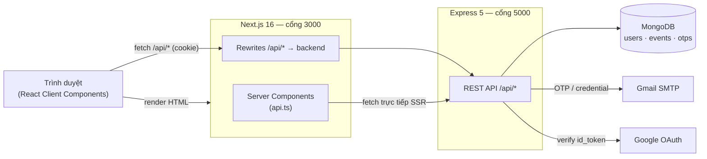
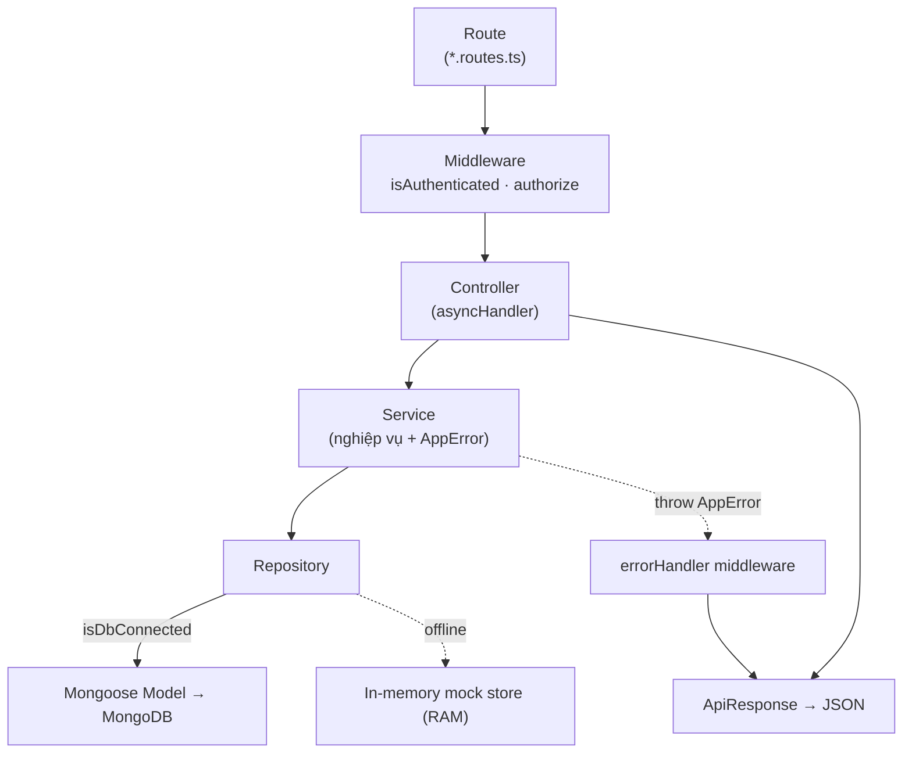
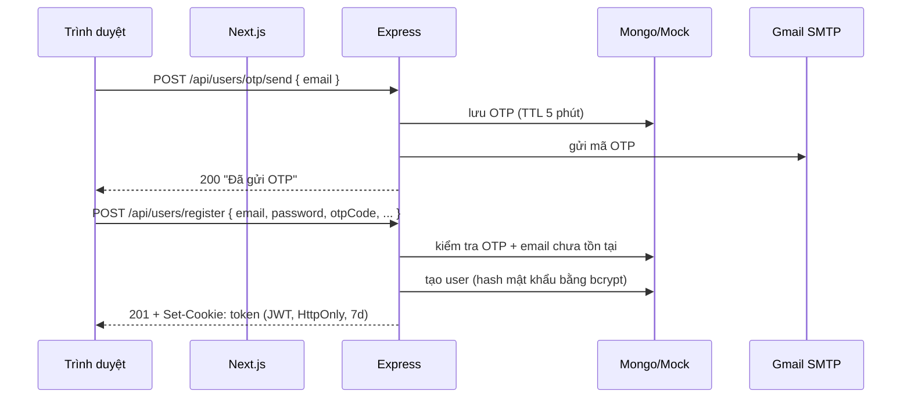
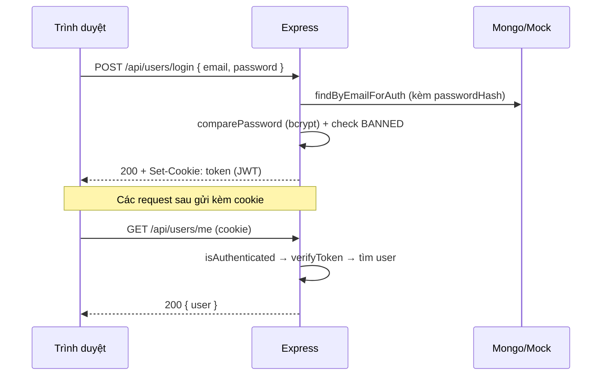
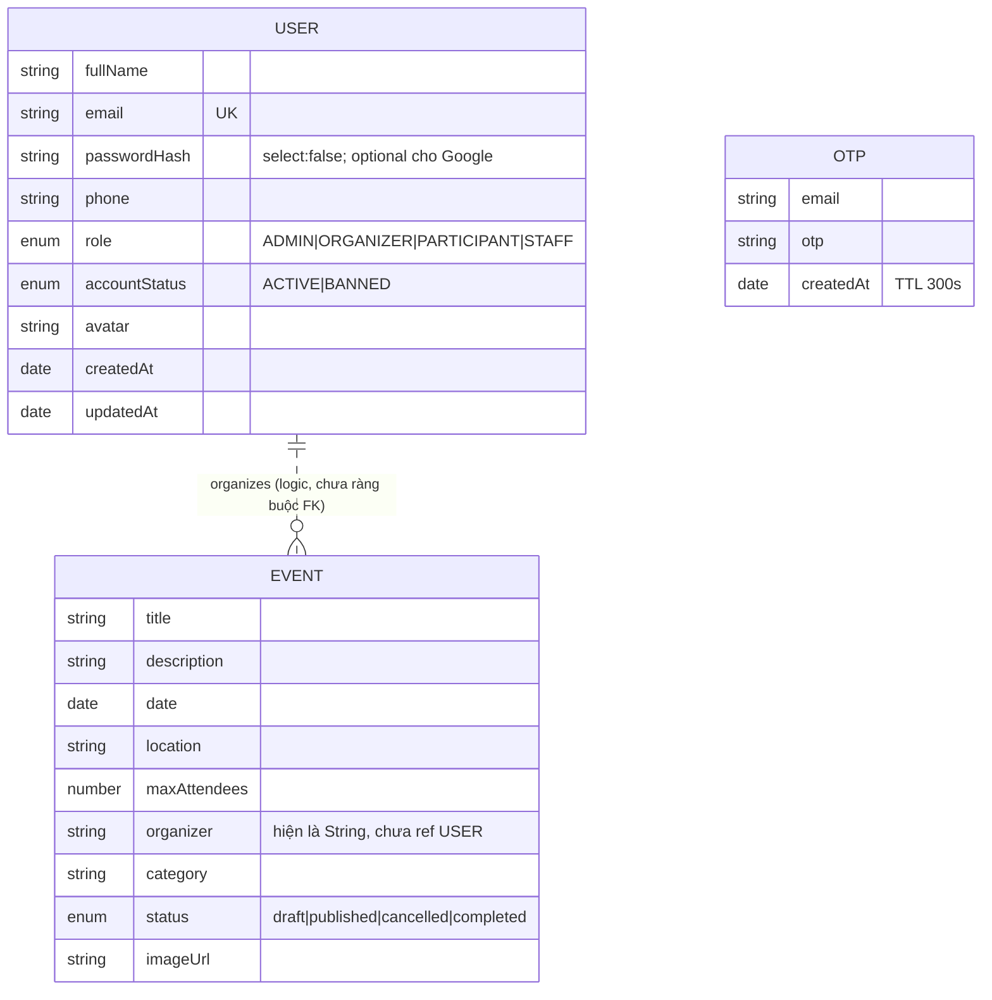
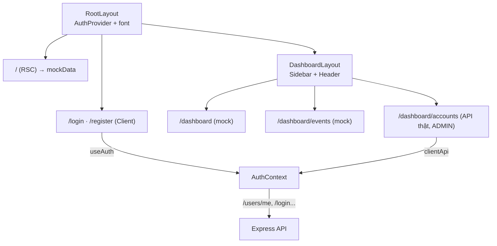

# System Architecture — Event Management (EventBox)

> Cập nhật: 2026-06-30 · Branch: `develop`
> Đọc kèm [`codebase-summary.md`](./codebase-summary.md) và [`code-standards.md`](./code-standards.md).

## 1. Tổng quan topology

Kiến trúc tách rời: Next.js frontend ↔ Express backend ↔ MongoDB. Trình duyệt **không**
gọi thẳng backend mà đi qua Next.js (rewrites) để cookie HttpOnly hoạt động cùng origin.



- **Server Components** dùng `lib/api.ts` gọi thẳng `API_BASE_URL` (SSR, nhanh, tốt SEO).
- **Client Components** dùng `lib/client-api.ts` gọi đường dẫn tương đối `/api/*`; Next
  rewrite (`next.config.ts`) chuyển tiếp về `http://localhost:5000/api/*`. Nhờ cùng origin,
  cookie `token` (HttpOnly) tự động đính kèm.

## 2. Backend — Modular Monolith

Một process Express duy nhất, chia theo **feature module** thay vì theo lớp kỹ thuật.
Mỗi request đi qua chuỗi tầng cố định:



### Khởi động (`server.ts`)
1. `connectDatabase()` — thử kết nối Mongo; thất bại thì bật offline mock mode (không crash).
2. `app.listen(config.port)` — log môi trường, DB URI, frontend URL.

### Middleware toàn cục (`app.ts`, theo thứ tự)
`helmet` → `cors({ origin: frontendUrl, credentials: true })` → `cookieParser` →
`morgan('dev')` → `express.json` → `express.urlencoded` → routes → `notFoundHandler` →
`errorHandler`.

### Mount routes
- `GET /api/health` — health check.
- `/api/events` → `eventRoutes`.
- `/api/users` → `userRoutes`.

### Offline mock mode
`config/database.ts` export cờ `isDbConnected`. Repository của `user` rẽ nhánh: nếu kết nối
DB thì dùng Mongoose, nếu không thì thao tác trên `mockUsersStore` (RAM) — cho phép demo
auth/admin mà không cần Mongo. Module `event` **chưa** có nhánh mock.

## 3. Luồng xác thực (Authentication)

### 3.1 Đăng ký qua OTP



### 3.2 Đăng nhập & phiên làm việc



- **JWT payload**: `{ id, email, role }`, ký bằng `JWT_SECRET`, hạn `JWT_EXPIRES_IN` (7d).
- **Cookie**: `httpOnly`, `sameSite: 'strict'`, `secure` ở production, `maxAge` 7 ngày.
- **`isAuthenticated`**: đọc token từ cookie (ưu tiên) hoặc header `Authorization: Bearer`;
  verify → kiểm tra user còn tồn tại + chưa bị `BANNED` → gán `req.user`.
- **`authorize(...roles)`**: chặn nếu `req.user.role` không thuộc danh sách.

### 3.3 Google OAuth
Frontend nạp Google Identity script, lấy `credential` (id_token) → `POST /api/users/google`.
Backend verify qua `google-auth-library`; nếu chưa cấu hình `GOOGLE_CLIENT_ID` hoặc token
dạng `mock_*` thì dùng nhánh mock cho mục đích học tập/demo. Người dùng mới mặc định role
`PARTICIPANT`.

## 4. Mô hình dữ liệu



- **User**: `email` unique + index; `passwordHash` có `select: false` (phải `.select('+passwordHash')`
  khi auth); pre-save hook tự hash mật khẩu bằng bcrypt; method `comparePassword`.
- **Event**: index trên `{date, status}`, `category`, `organizer`. `organizer` đang lưu dạng
  chuỗi — chưa liên kết khóa ngoại tới `User`.
- **OTP**: TTL index xóa tự động sau 300 giây.

## 5. Hợp đồng API (API contract)

Mọi response bọc trong `ApiResponse`:

```jsonc
// Thành công
{ "success": true, "message": "…", "data": { … }, "meta": { …pagination } }
// Lỗi (errorHandler)
{ "success": false, "message": "…", "stack": "… (chỉ ở development)" }
```

- **Phân trang** đặt trong `meta`: `{ currentPage, totalPages, totalItems, itemsPerPage }`.
  Controller truyền `result.pagination` vào tham số `meta` của `ApiResponse.ok`.
- **Mã lỗi** sinh từ `AppError(message, statusCode)` trong service; `errorHandler` map về
  HTTP status tương ứng (400/401/403/404/409/500…).

### Bảng endpoint

| Method | Endpoint | Auth | Mô tả |
|--------|----------|------|-------|
| GET | `/api/health` | — | Health check |
| POST | `/api/users/otp/send` | — | Gửi OTP đăng ký |
| POST | `/api/users/register` | — | Đăng ký (kèm OTP) |
| POST | `/api/users/login` | — | Đăng nhập email/password |
| POST | `/api/users/google` | — | Đăng nhập Google |
| POST | `/api/users/logout` | — | Xóa cookie phiên |
| GET | `/api/users/me` | cookie | Thông tin user hiện tại |
| GET | `/api/users/admin` | ADMIN | Danh sách tài khoản (lọc + phân trang) |
| POST | `/api/users/admin/staff` | ADMIN | Tạo tài khoản STAFF |
| POST | `/api/users/admin/:id/role` | ADMIN | Đổi role |
| POST | `/api/users/admin/:id/status` | ADMIN | Khóa/mở khóa |
| DELETE | `/api/users/admin/:id` | ADMIN | Xóa tài khoản |
| GET | `/api/events` | — ⚠️ | Danh sách sự kiện |
| GET | `/api/events/:id` | — | Chi tiết sự kiện |
| POST | `/api/events` | — ⚠️ | Tạo sự kiện |
| PUT | `/api/events/:id` | — ⚠️ | Cập nhật sự kiện |
| DELETE | `/api/events/:id` | — ⚠️ | Xóa sự kiện |

⚠️ = hiện public, **nên** bổ sung `isAuthenticated` + `authorize('ORGANIZER','ADMIN')`.

## 6. Frontend — tầng & luồng render



- **AuthContext** là nguồn sự thật về user phía client; nạp `/users/me` khi khởi động.
- **Phân quyền UI**: Sidebar thêm mục admin theo `user.role`; trang `accounts` tự chặn nếu
  không phải `ADMIN` (nhưng bảo mật thật vẫn nằm ở backend `authorize`).

## 7. Cân nhắc bảo mật

- Token trong **cookie HttpOnly** (chống XSS đọc token) + `sameSite: strict` (giảm CSRF).
- `helmet` đặt security headers; `cors` giới hạn theo `FRONTEND_URL` + cho phép credentials.
- Mật khẩu hash **bcrypt** (salt 10). `passwordHash` không trả về client (`select:false`
  + xóa thủ công trong service).
- **Rủi ro cần xử lý**: (a) event routes public; (b) Google OAuth dev-fallback tự đăng nhập;
  (c) `JWT_SECRET` mặc định `'default_secret'` nếu thiếu env — phải đặt secret thật ở mọi
  môi trường; (d) đảm bảo `.env` không bị commit.

## 8. Câu hỏi chưa giải quyết

- Có triển khai refresh-token / xoay token không, hay chấp nhận JWT 7 ngày phẳng?
- Event nên ràng buộc `organizer` theo `ObjectId` ref `User` ở thời điểm nào?
- Chiến lược deploy (cùng host vs tách dịch vụ) và biến môi trường production — bổ sung vào
  `deployment-guide.md` khi có quyết định.
